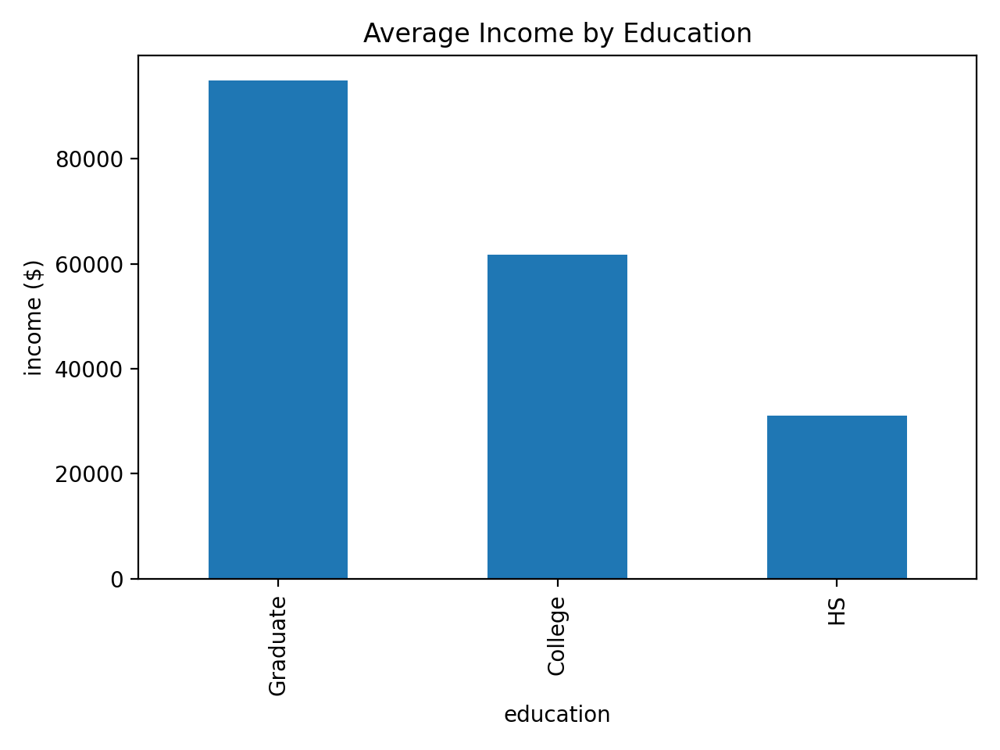

# Income vs Education (Quick Analysis)

## Goal
Assess whether average income varies by education level in a small sample.

## Data
- File: `data/raw/income_sample.csv`  
- Columns: `age`, `education`, `income`

## Method
1. Load CSV with pandas.
2. Group by `education`.
3. Compute mean `income` per group.
4. Plot a bar chart of mean income by education and save.

Example code:
```python
import pandas as pd
import matplotlib.pyplot as plt

df = pd.read_csv("data/raw/income_sample.csv")
means = df.groupby("education", observed=True)["income"].mean().sort_values(ascending=False)

means.plot(kind="bar", rot=0)
plt.ylabel("Average Income")
plt.title("Average Income by Education")
plt.tight_layout()
plt.savefig("docs/avg_income_by_education.png", dpi=150)
```

## Result
The chart indicates higher education levels correspond to higher average income in this sample:
- Graduate > College > HS


## Notes / Limitations
- Tiny sample; not necessarily generalizable.
- No controls for age, occupation, location, or sampling bias.
- Next steps: analyze a larger dataset, include covariates, and run statistical tests.
# Income vs Education (Quick Analysis)

## Data
- File: data/raw/income_sample.csv
- Rows: 7
- Columns: age, education, income

## Question
Does income differ by education level?

## Results
- Average income by education (from groupby):
    - Graduate: ~95,000
    - College: ~61,667
    - HS: ~31,000

## Visualization


## Notes / Limitations
- Very small sample size (only a few rows), so this is just a demo.

Summary table: income_by_education_summary.csv
# Income by Education Report

## Data
Source: `data/raw/income_sample.csv`

Columns:
- age
- education
- income

## Results

### Average Income by Education


### Summary Table
The summary table is saved here: `docs/income_by_education_summary.csv`

Key takeaway:
- Graduate has the highest average income
- College is next
- High School (HS) is lowest
